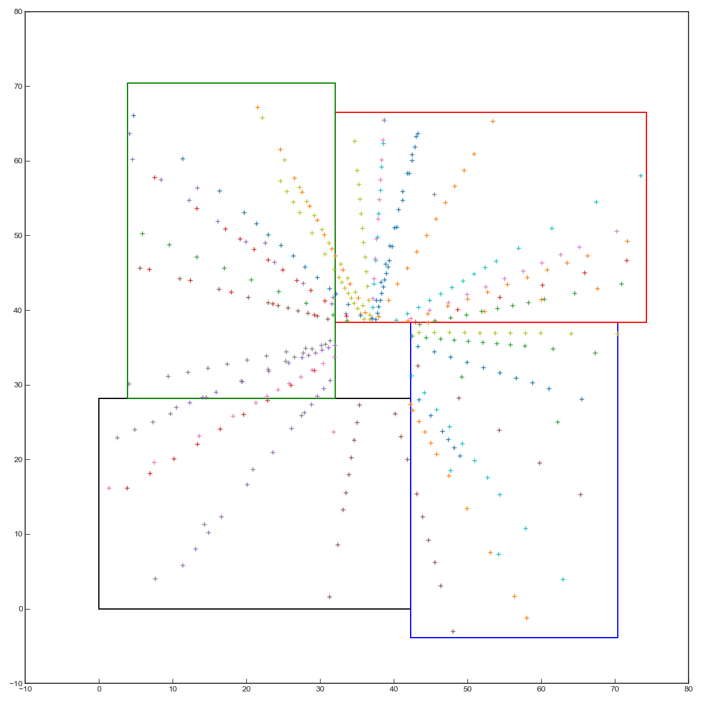
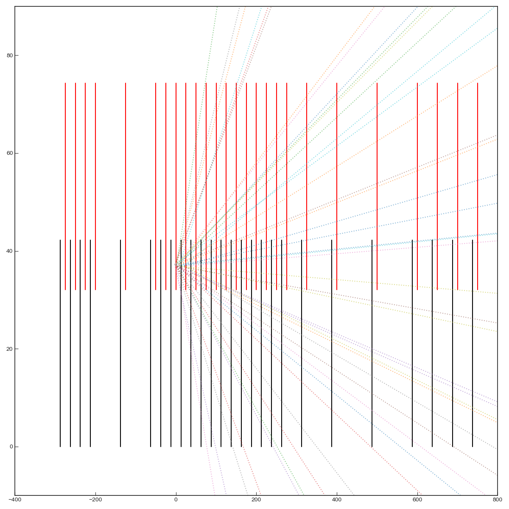

# ParametricVELO

Parametric simulation of LHCb Run 3 VELO track hits for reconstruction studies. Ray traces tracks sampled from FONLL momenta and tests for intersection with the geometry using hierarchical bounding volumes.

